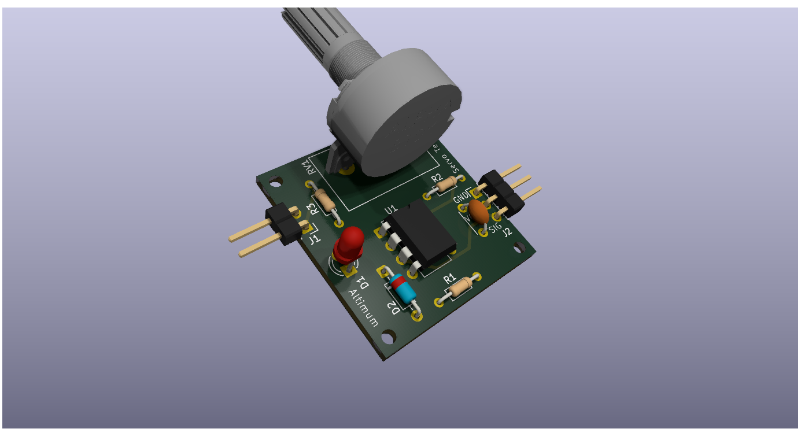
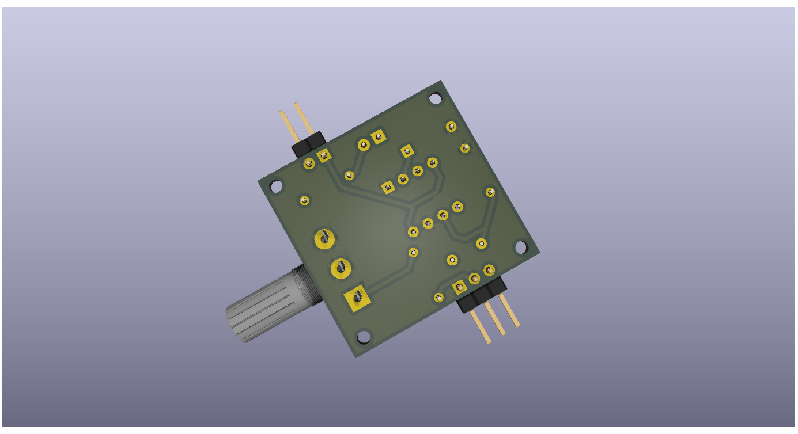

# SERVO MOTOR TESTER PCB Design using KICAD -ALTIMUM
## PCB TOP VIEW

## PCB BOTTOM VIEW

## Project Overview🔧
This servo tester circuit is designed to generate a controlled PWM (Pulse Width Modulation) signal to test and position a standard servo motor by producing periodic control pulses at approximately 50Hz, where the pulse width (typically between 1ms and 2ms) determines the angular position of the servo shaft; the circuit uses a timing configuration (such as a timer IC–based oscillator stage) to create stable pulses, and a potentiometer is used to vary the pulse width, allowing smooth manual adjustment of the servo position from minimum to maximum angle, while resistors and capacitors set the timing frequency and ensure signal stability; the output PWM signal is connected to the servo’s control pin, with proper 5V power and ground connections provided to drive the motor reliably. The circuit is tested by connecting a standard servo motor to the output, supplying 5V power, and rotating the potentiometer to observe smooth movement of the servo shaft across its range, confirming correct pulse generation and operation. This project is my attempt at learning KiCad and understanding how PWM-based servo control circuits are designed, tested, and implemented at the schematic level.
